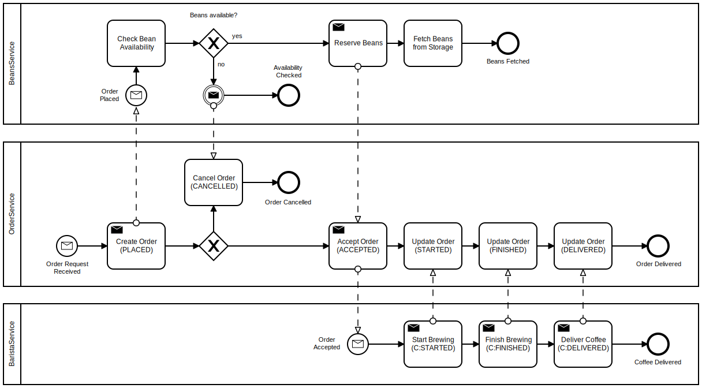

# Event Sourcing and CQRS with Lagom

## Table of Contents

-   <a href="#introduction">Introduction</a>
-   <a href="#architecture">Architecture of the Application</a>
-   <a href="#implementation">Implementation of the Application</a>
    -   <a href="#request-processing">Processing a `POST /orders` Request</a>
        -   <a href="#write-side-update">Updating the Write-Side</a>
        -   <a href="#read-side-update">Updating the Read-Side</a>
        -   <a href="#event-forwarding">Communicating Events to Other Microservices</a>
-   <a href="#execution">Running the Application</a>
-   <a href="#discussion">Discussion of the Results</a>

<a id="introduction"></a>
## Introduction

The goal of this project was to implement an application based on Lagom
[[1]], which is an open source microservice framework for Java an Scala
that highly encourages the use of Event Sourcing [[2]] and Command Query
Responsibility Segregation (CQRS) [[3]].

The implemented application is a clone of Sebastian Daschner's
*Scalable, event-driven coffee shop* [[4]], which demonstrates how Event
Sourcing and CQRS can be implemented with JavaEE. The choice to
re-implement the coffee shop application was made because it offered an
opportunity to directly compare some of the differences between the
Lagom and JavaEE approaches to Event Sourcing and CQRS.

<a id="architecture"></a>
## Architecture of the Application

The application consists of three microservices that are running the
coffee shop:

-   The **Orders** microservice, through which coffee orders can be
    placed and the status of existing orders can be checked. 
-   The **Beans** microservice, through which coffee beans can be
    stored. The service also checks whether beans that are required
    to produce the coffee for placed orders are available and fetches
    them from storage.
-   The **Barista** microservice, which is responsible for the brewing
    and delivery of the coffee that is requested in accepted orders.

Publicly available functionalities of the services can be accessed
through a JSON based REST API, which contains the following endpoints:

-   Orders:
    -   Path: `POST /orders`  
        Description: Place a new order  
        Request body:
        ```
        {
          "beanOrigin" : String,
          "cofffeeType" : ["ESPRESSO" | "POUR_OVER" | "FRENCH_PRESS"]
        }
    -   Path: `GET /orders/{id}`  
        Description: Get an existing order  
        Repsonse body:
        ```
        {
          "orderId" :  UUID,
          "beanOrigin" : String,
          "coffeeType" :  ["ESPRESSO" | "POUR_OVER" | "FRENCH_PRESS"],
          "orderStatus" : ["PLACED" | "ACCEPTED" | "STARTED" | "FINISHED" | "DELIVERED" | "CANCELLED"],
        }
        ```
-   Beans:
    -   Path: `POST /beans`  
        Description: Put beans into storage  
        Request body:
        ```
        {
          "beanOrigin" : String,
          "amount" : Integer
        }
        ```
    -   Path: `GET /beans`  
        Description: Get the currently stored beans  
        Response body:
        ```
        [
          {
            "beanOrigin" : String,
            "amount" : Integer
          }
          ...
        ]
        ```

The Barista microservice doesn't have any REST endpoints. All of its
communication is done through an Apache Kafka based communication
mechanism which the microservices are using for internal communication
between each other.

Shown below is the processing flow for a `POST /orders` request, which
shows more clearly what the responsibilities of the three microservices
are and when communication between them takes place:

 

The processing that is necessary for the remaining API endpoints is
rather unspectacular in comparison, since no communication between the
microservices is needed for them. Because of this, only the
`POST /orders` endpoint will be described in more detail.

<a id="implementation"></a>
## Implementation of the Application

Microservices in Lagom are always split into an API module that
describes the service and an implementation module that implements it.
For the orders microservice, the interface that describes the services
looks as follows:

```java
public interface OrdersService extends Service {
  String ORDERS_TOPIC = "orders";

  @Override
  default Descriptor descriptor() {
    return named("orders")
      .withCalls(
        pathCall("/orders/:id", this::getOrder),
        namedCall("/orders", this::orderCoffee)
      )
      .withTopics(topic(ORDERS_TOPIC, this::ordersTopic));
  }

  ServiceCall<NotUsed, Optional<OrderResponse>> getOrder(UUID id);

  ServiceCall<OrderCoffeeRequest, Done> orderCoffee();

  Topic<OrdersEvent> ordersTopic();
}
```

As we can see, `pathCall` and `namedCall` are used to map the API
endpoints `/orders/:id` and `/orders` to specific methods with
`ServiceCall` return types, which define the request and response types
of each endpoint. The only difference between `pathCall` and `namedCall`
is that `pathCall` can have parameters while `namedCall` can not. The
HTTP verb that is used for each endpoint is automatically determined
from the request and response types of the mapped `ServiceCall` (GET by
default, POST if a request type is present), but can also be set
manually by using `restCall` instead.

Using `withTopics`, the service also defines a Kafka topic, which, as
mentioned in the architecture section of this documentation, is used for
internal communication between the different microservices. The events
that are published to this topic by the orders service are `OrdersEvents`
that represent state changes of each of the underlying orders, for
example `OrderPlaced`, `OrderAccepted` etc.

<a id="request-processing"></a>
## Processing a `POST /orders` Request

When a request is sent to the `/orders` endpoint, the implementation
of the mapped method is called. For `orderCoffee`, this implementation 
looks like the following:

```java
public class OrdersServiceImpl implements OrdersService {
  private final PersistentEntityRegistry registry;

  @Inject
  public OrdersServiceImpl(PersistentEntityRegistry registry, ...) {
    this.registry = registry;

    ...
    
    this.registry.register(OrderEntity.class);
  }

  @Override
  public ServiceCall<OrderCoffeeRequest, Done> orderCoffee() {
    return request -> {
      UUID orderId = request.getOrderId();

      Order order = new Order(
        orderId,
        request.getCoffeeType(),
        request.getBeanOrigin());

      PlaceOrder command = new PlaceOrder(order);

      return this.registry
        .refFor(OrderEntity.class, orderId.toString())
        .ask(command);
    };
  }
  
  ...
}
```

With `this.registry.refFor(...).ask(command)`, the orders service tells
the write-/command-side (=> CQRS) of the corresponding order entity
that the `PlaceOrder` command should be executed.

What should happen in response to such a command is defined in the
`OrderEntity` class. For an order entity that doesn't exist yet, as is
the case for every newly placed order, the relevant parts of the
implementation are the following:


```java
public class OrderEntity extends PersistentEntity<OrderCommand, OrdersEvent, Optional<OrderState>> {

  @Override
  public Behavior initialBehavior(Optional<Optional<OrderState>> snapshotState) {
    Optional<OrderState> state = snapshotState.flatMap(Function.identity());

    if (!state.isPresent()) {
      return notCreated();
    } else {
      ...
    }
  }

  private Behavior notCreated() {
    BehaviorBuilder builder = newBehaviorBuilder(Optional.empty());

    // Command Handlers:
    builder.setCommandHandler(PlaceOrder.class,
      (cmd, ctx) -> ctx.thenPersist(
        new OrderPlaced(cmd.getOrder())));

    // Event Handlers:
    builder.setEventHandlerChangingBehavior(OrderPlaced.class, event ->
      placed(new OrderState(event.getOrder(), PLACED)));

    return builder.build();
  }

  ...
}
```

Since we have asked the entity to process a `PlaceOrder` command, the 
corresponding command handler will be executed. In this case, all the
handler does is to persist an `OrderPlaced` event (=> Event Sourcing)
with information about the new order.

<a id="write-side-update"></a>
### Updating the Write-Side

Just below the command handler, the event handler for the `OrderPlaced`
event ensures that the write-side state of the order is updated with
the order information from the new event. Since the order is then no
longer in a "notCreated" state, its accepted commands and event handlers
change to the following:

```java
public class OrderEntity extends PersistentEntity<OrderCommand, OrdersEvent, Optional<OrderState>> {

  @Override
  public Behavior initialBehavior(Optional<Optional<OrderState>> snapshotState) {
    Optional<OrderState> state = snapshotState.flatMap(Function.identity());

    if (state.isPresent()) {
      switch (state.get().getStatus()) {
        case PLACED:
          return placed(state.get());
        ...
      }
    } else {
      ...
    }
  }

  private Behavior placed(OrderState state) {
    BehaviorBuilder builder = newBehaviorBuilder(Optional.of(state));

    // Command Handlers:
    builder.setReadOnlyCommandHandler(PlaceOrder.class, this::alreadyDone);

    builder.setCommandHandler(AcceptOrder.class,
      (cmd, ctx) -> ctx.thenPersist(
        new OrderAccepted(cmd.getOrderId())));

    builder.setCommandHandler(CancelOrder.class,
      (cmd, ctx) -> ctx.thenPersist(
        new OrderCancelled(cmd.getOrderId(), cmd.getReason())));

    // Event Handlers:
    builder.setEventHandlerChangingBehavior(OrderAccepted.class, event ->
      accepted(state.withStatus(ACCEPTED)));

    builder.setEventHandlerChangingBehavior(OrderCancelled.class, event ->
      cancelled(state.withStatus(CANCELLED)));

    return builder.build();
  }

  private void alreadyDone(Object command, ReadOnlyCommandContext<Done> ctx) {
    ctx.reply(Done.getInstance());
  }
  
  ...
}
```

As we can see from this piece of code, the entity will now no longer
persist additional `OrderPlaced` events for further `PlaceOrder`
commands, but will instead answer all `OrderPlaced` commands for the
same order with a `Done` response.

However, the entity will now accept and persist events for `AcceptOrder`
and `CancelOrder` commands, if any of these do occur in the future (if
the entity were to receive commands for which no handler is registered,
it would simply return an error response).

<a id="read-side-update"></a>
### Updating the Read-Side

By default, Lagom uses an Apache Cassandra database [[5]] for the
read-side of entities. To ensure the read-side is eventually consistent
with the write-side, a `ReadSideProcessor` is used that listens to
`OrderEvents` that were triggered by the write-side and updates the
database accordingly:

```java
public class OrdersEventProcessor extends ReadSideProcessor<OrdersEvent> {
  private final CassandraSession session;
  private final CassandraReadSide readSide;

  // "INSERT INTO orders(orderId, coffeeType, beanOrigin, orderStatus) VALUES (?, ?, ?, ?)"
  private PreparedStatement insertOrderStatement;

  @Inject
  public OrdersEventProcessor(CassandraSession session, CassandraReadSide readSide) {
    this.session = session;
    this.readSide = readSide;
  }

  @Override
  public ReadSideHandler<OrdersEvent> buildHandler() {
    return this.readSide.<OrdersEvent>builder("orders_offset")
      .setGlobalPrepare(this::createTables)
      .setEventHandler(OrderPlaced.class, this::processOrderPlaced)
      ...
      .build();
  }

  private CompletionStage<Done> createTables() {
    return this.session.executeCreateTable(
      "CREATE TABLE IF NOT EXISTS orders(" +
        "orderId UUID," +
        "coffeeType TEXT," +
        "beanOrigin TEXT," +
        "orderStatus TEXT," +
        "PRIMARY KEY (orderId)" +
      ")"
    );
  }

  private CompletionStage<List<BoundStatement>> processOrderPlaced(OrderPlaced event) {
    Order order = event.getOrder();

    return completedStatements(this.insertOrderStatement.bind(
      order.getOrderId(),
      order.getCoffeeType(),
      order.getBeanOrigin(),
      OrderStatus.PLACED)
    );
  }
  
  ...
}
```

Note that there's no need to store the read-side information of an
entity in a single table or in a normalized format. If a different
schema is better suited for the queries that are executed on the
read-side, then it is highly encouraged to use such a read-optimized
schema for the read-side, since performance of write operations isn't
relevant for the read-side anyway.

<a id="event-forwarding"></a>
### Communicating Events to Other Microservice 

To publish order events to a Kafka topic, the orders service implements
the following method:

```java
public class OrdersServiceImpl implements OrdersService {
  private final PersistentEntityRegistry registry;

  @Override
  public Topic<OrdersEvent> ordersTopic() {
    return TopicProducer.singleStreamWithOffset(
      offset -> this.registry.eventStream(OrdersEvent.TAG, offset)
    );
  }
  
  ...
}}
```

Other services can subscribe to this topic in their own implementation
classes. For example, to have the beans service check whether enough
beans are stored to fulfill placed orders, it subscribes to the
published order events like this:

```java
public class BeansServiceImpl implements BeansService {

  @Inject
  public BeansServiceImpl(OrdersService ordersService, ...) {
    ...
    
    ordersService.ordersTopic().subscribe().atLeastOnce(
        Flow.<OrdersEvent>create().mapAsync(1, this::handleOrdersEvent)
    );
  }

  private CompletionStage<Done> handleOrdersEvent(OrdersEvent event) {
    if (event instanceof OrderPlaced) {
      return handleOrderPlaced((OrderPlaced) event);
    } else {
      return CompletableFuture.completedFuture(Done.getInstance());
    }
  }

  private CompletionStage<Done> handleOrderPlaced(OrderPlaced event) {
    Order order = event.getOrder();

    ReserveBeans command = new ReserveBeans(
      order.getBeanOrigin(),
      order.getOrderId());

    return this.registry
      .refFor(BeansEntity.class, command.getBeanOrigin())
      .ask(command);
  }
  
  ...
}
```

If the bean reservation is successful, i.e. enough beans are in storage
to fulfill the order, the beans service will persist a corresponding 
`BeansReserved` event in response to the `ReserveBeans` command and
publish this event to a Kafka topic of its own. Since the orders service
also subscribes to the events that the beans service publishes, it will
then know that the beans are available and trigger further order
processing steps, ending with the successful delivery of the order
(since the remaining processing flow only reuses the concepts that
were already shown, it won't be described in more detail here).

If, on the other hand, the beans service finds that the beans storage
doesn't contain the needed beans, it will persist and publish a
`BeansNotAvailable` event, thereby causing the orders service to
cancel the order.

<a id="execution"></a>
## Running the Application

To run the application, simply execute the following Maven command in
the scalable-coffee-shop directory:

```
mvn lagom:runAll
```

Lagom will then automatically start the implemented microservices, a
service registry and an API gateway as well as a Kafka and Cassandra
instance.

The API gateway runs at `http://127.0.0.1:9000` and the services
that are registered with the service registry can be checked at
`http://127.0.0.1:9008/services`, which returns a JSON response like
to the one shown below, listing the names of the services and ports on
which they are running:

```json
[
  {"name":"orders","url":"http://127.0.0.1:59648","portName":null},
  {"name":"orders","url":"http://127.0.0.1:59648","portName":"http"},
  {"name":"barista","url":"http://127.0.0.1:64186","portName":null},
  {"name":"barista","url":"http://127.0.0.1:64186","portName":"http"},
  {"name":"beans","url":"http://127.0.0.1:61828","portName":null},
  {"name":"beans","url":"http://127.0.0.1:61828","portName":"http"},
  {"name":"cas_native","url":"tcp://127.0.0.1:4000/cas_native","portName":null},
  {"name":"kafka_native","url":"tcp://127.0.0.1:9092/kafka_native","portName":null}
]
```

Requests to the API endpoints that were described in the
<a href="#architecture">architecture<a> section of this documentation can
then be sent to either the API gateway or directly to the corresponding
microservices.

Although the application is pretty much fully-implemented, I was,
unfortunately, not able to get it to work correctly. While it does
start up successfully and requests can be sent to the API endpoints,
there appears to be some sort of error with the Kafka based
communication between microservices, leading to errors like the
following whenever any such communication is attempted:

```
16:31:20.004 [warn] org.apache.kafka.common.utils.AppInfoParser [] - Error registering AppInfo mbean 
javax.management.InstanceAlreadyExistsException: kafka.consumer:type=app-info,id=beans-2
```

Since the Kafka consumers are handled by Lagom, there doesn't seem to be
a way to really fix this issue as a user of the framework, or if does I
didn't find it (results are the same with Maven and sbt, both on Windows
and macOS).

An issues in Lagom's GitHub repository describes the same problem [[6]].
However, the issue is from 2016 and was, supposedly, fixed shortly after
it was opened (though with a "Fixes #issue-id?" message, which is
perhaps not as confidence-inducing as it could be).

<a id="discussion"></a>
## Discussion of the Results

As with most of the projects that I implemented during this semester,
the Lagom implementation of the scalable coffee shop was also off to 
a rather rocky start initially. This was mostly due to the fact that
it was really difficult for me to understand how the Event Sourcing and
CQRS concepts that I had read about could be implemented with Lagom.
While Lagom does provide two example projects that are supposed to
demonstrate this, both of them are using so many different and sometimes
rather advanced features of Lagom that I just couldn't manage to
distinguish the essentials from everything else. By reading the
documentation on the Lagom website, I slowly managed to piece together a
big picture overview of the most important components. However, I really
do think that this process could have been made much easier if Lagom did
provide a tutorial and example for an application that is more advanced
than their "hello world" template (which doesn't even have a read-side)
and less advanced than the "Cirper" and "Online Auction" applications.

Once the initial hurdles were taken and I had a basic understanding of
the general program flow, Lagom really started to grow on me. Although
the framework does force some architectural decisions onto you
(separation of API and implementation modules, read- and write-side
in different classes, cross-microservice communication through a message
broker, explicitly defined commands and events, ...), these decisions
seem to be well thought-through, usually nudging you towards a clear and
well-defined architecture, and never felt too limiting. As soon as
you've understood the basics, the forced uniformity also makes it rather
easy to understand other Lagom projects (e.g. the two example projects
that I had trouble with at first). While this doesn't matter all that
much if you're working alone on a single project like I was, it would
could be quite beneficial when you're working in a team of developers
that is responsible for a larger number of projects and microservices.
That you're getting additional features such as a service registry, an
an API gateway, a circuit breaker and easily configurable sharding out
of the box only adds to the charm.

Although I didn't manage to get rid of the Kafka errors, I don't really
want to hold this against Lagom. Given that there are no other recent
reports of the problem, I can't help but think that it is, at least
partially, my fault, rather just some Lagom bug, and even if it is a
bug, it might very well be fixed in a future release. Either way, Lagom
will definitely be one of the options that I'll look at again if I ever
have to implement any microservices in the future.

[1]: https://github.com/IdentityServer/IdentityServer4
[2]: https://martinfowler.com/eaaDev/EventSourcing.html
[3]: https://martinfowler.com/bliki/CQRS.html
[4]: https://github.com/sdaschner/scalable-coffee-shop
[5]: http://cassandra.apache.org/
[6]: https://github.com/lagom/lagom/issues/215
